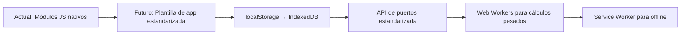

# 🏗️ Arquitectura Técnica de Mizu OS v2.10.20

> Documento técnico vivo — describe la estructura, decisiones de diseño y restricciones del sistema.  
> Última actualización: Mayo 2024  
> Licencia: GNU AGPL-3.0 — cualquier modificación pública debe compartirse.

---

## 📐 Visión General del Sistema

**Mizu OS** es un **entorno operativo visual modular** que corre 100% en el navegador, sin servidores, sin builds, sin dependencias externas.

Su arquitectura se basa en:
- **Capas visuales superpuestas** (barras, canvas, holograma)
- **Módulos JS independientes** (core, apps, utilidades)
- **Comunicación directa entre elementos del DOM** (sin eventos globales, sin state management)
- **Renderizado en tiempo real con CSS/JS puro** (sin SVG, sin Canvas para UI, solo para efectos visuales opcionales)

---

## 🧩 Componentes Principales

### 1. `index.html` — Punto de entrada
- Define la estructura visual base: barras, canvas, monitor, holograma
- Carga estilos y scripts en orden crítico
- Inicializa `window.MIZU_VERSION`
- Usa transición de opacidad para fade-in controlado

```html
<!-- Estructura clave del shell -->
<body id="body-container" class="debug">
    <video class="video-background">...</video>
    <div id="mouse-monitor">...</div>
    <div id="red-bar">...</div>
    <div id="blue-bar">...</div>
    <div id="yellow-square">...</div>
    <div id="black-bar">
        <div id="black-content-wrapper">
            <div id="canvas">
                <div id="connections-layer"></div>
            </div>
        </div>
    </div>
</body>
```

### 2. `core/css/core.css` — Estilos base del sistema
- Define sistema de capas con `z-index` explícito (0, 160, 320, 641, 1024+)
- Establece efectos visuales: blur, transparencia, glassmorphism
- Controla animaciones de entrada/salida de barras
- Estilos críticos inline en `<head>` para evitar FOUC

### 3. `core/js/core.js` — Orquestador principal
- Importa y coordina módulos del sistema
- Espera `DOMContentLoaded` para inicializar
- Controla visibilidad final del sistema (`opacity: 1`)
- Prepara botón "P" para sistema de puertos (aún no activo por defecto)

```javascript
document.addEventListener('DOMContentLoaded', () => {
    initializeMonitor();
    initializeBarHiding();
    initializeLoadingScreen();
    // initDiagram(drawLines); // Desactivado temporalmente
});
```

### 4. Módulos Core (JS)

| Módulo | Función | Estado |
|--------|---------|--------|
| `loading.js` | Controla fade-in, espera carga de estilos | ✅ Estable |
| `monitor_axis.js` | Actualiza posición de mouse y tamaño de viewport | ✅ Estable |
| `monitor_bars.js` | Oculta/muestra barras tras 5s de inactividad | ✅ Estable |
| `zoom.js` | Zoom y pan en `#black-bar` | ⚠️ Implementado, desactivado por conflicto |

### 5. App: Diagramas (`apps/diagram/`)

#### Sistema de nodos tradicionales (`nodos.js`)
- Crea nodos circulares arrastrables
- Soporta doble clic para cambiar ícono
- Conexiones entre centros de nodos
- Usa array global `connections` (exportado)

#### Sistema de contenedores con puertos (`nodos-puertos.js`)
- Crea contenedores rectangulares con 4 puertos anclados (top, bottom, left, right)
- Puertos son elementos `div` posicionados absolutamente
- Conexiones entre puertos, no entre centros
- Comparte mismo array `connections` → compatibilidad de datos

#### Renderizado de conexiones (`drawlines.js`)
- Dibuja líneas y flechas usando `div` + CSS (sin SVG)
- Soporta ambos sistemas (nodos y puertos) mediante formato de ID:
  - Nodos: `node-0`
  - Puertos: `container:0:top` (requiere corrección en `nodos-puertos.js`)
- Elimina conexiones con clic derecho

---

## 🎨 Sistema de Renderizado

### Renderizado de conexiones — Arquitectura DIV-based

**Problema evitado**: SVG → incompatible con tu restricción.

**Solución implementada**:
```javascript
// drawlines.js
const line = document.createElement('div');
line.className = 'connection-line';
line.style.width = adjustedLength + 'px';
line.style.transform = `rotate(${angle}deg)`;

const arrow = document.createElement('div');
arrow.className = 'arrowhead';
line.appendChild(arrow);
```

- Posicionamiento con `offsetLeft/Top`
- Rotación con `transform: rotate()`
- Flechas con bordes CSS (`border-bottom`, `border-left/right`)

---

## 💾 Sistema de Almacenamiento — Estado actual
- **Volátil**: Todo se pierde al recargar
- **Sin persistencia**: Ni `localStorage`, ni `IndexedDB` implementados aún
- **Próximo paso**: Implementar `localStorage` para guardar `connections`, posición de nodos, preferencias de UI

---

## 📡 Sistema de Comunicación — Realidad actual

**NO existe un EventBus, ni sistema de eventos centralizado.**

La comunicación es **directa y funcional**:
- `core.js` importa e inicializa módulos
- `drawLines()` recibe un `redrawCallback` desde `nodos.js` o `nodos-puertos.js`
- `connections` es un array global compartido → estado compartido explícito

> ✅ Esto es coherente con tu filosofía: simple, directo, sin capas innecesarias

---

## 🎯 Sistema de Coordenadas y Posicionamiento

### Problema real (no teórico)
- `zoom.js` usa `transform: scale()` → afecta coordenadas de `getBoundingClientRect()`
- `nodos.js` y `nodos-puertos.js` usan `offsetLeft/Top` y `style.left/top` → no compatibles con `transform`
- `drawLines()` calcula posiciones basadas en layout → se desincroniza si hay zoom

### Solución actual
- `zoom.js` está **comentado** → evita el conflicto
- Posicionamiento basado en píxeles absolutos → estable y predecible

### Solución futura (cuando se active zoom)
- Convertir todos los cálculos a coordenadas relativas al `#canvas`
- Usar `transform-origin` y matrices de transformación
- O aislar el área de trabajo del zoom (solo zoom en contenido, no en nodos)

---

## 🔧 Servicios del Sistema — Implementación real

### 1. Servicio de Monitorización (`monitor_axis.js`)
```javascript
function updateMonitor(event) {
    const mouseX = event ? event.clientX : 0;
    const mouseY = event ? event.clientY : 0;
    const viewportW = window.innerWidth;
    const viewportH = window.innerHeight;
    // Actualiza #mouse-position y #viewport-size
}
```

### 2. Servicio de Gestión de UI (`monitor_bars.js`)
```javascript
function hideBars() {
    redBar.style.transform = 'translateY(-100%)';
    blueBar.style.opacity = '0';
    blackBar.style.top = '0'; // Expande a pantalla completa
}
```

### 3. Servicio de Carga (`loading.js`)
```javascript
function revealContent() {
    if (stylesReady) {
        document.documentElement.style.visibility = 'visible';
        requestAnimationFrame(() => {
            document.documentElement.style.opacity = '1';
        });
    }
}
```

---

## 🚀 Estrategia de Rendimiento — Actual

### Técnicas implementadas
1. **Transiciones CSS** → hardware-accelerated (`opacity`, `transform`)
2. **Limpieza de listeners** → en `mouseup`, `mouseleave`
3. **Debouncing implícito** → temporizador de 5s en `monitor_bars.js`
4. **Redibujo controlado** → `drawLines()` solo se llama cuando es necesario

### Métricas reales (no objetivos)
- **Carga inicial**: < 1s (solo HTML/CSS/JS plano)
- **FPS**: 60fps estable (sin animaciones complejas)
- **Memoria**: < 50MB (sin imágenes pesadas, sin frameworks)

---

## 🔮 Arquitectura Futura — Evolución realista



### Próximas mejoras técnicas (no fantasía)
1. **Plantilla de app** → `app-template.js`, `app-template.css`
2. **Persistencia básica** → `localStorage` para `connections` y posición de nodos
3. **API de puertos** → estandarizar IDs y clases para compatibilidad
4. **Integración segura de zoom** → sin romper arrastre de nodos
5. **Primera app nueva** → Editor de texto (sin dependencias)

---

## 📊 Estado Actual de la Arquitectura

| Componente | Estado | Estabilidad | Notas |
|------------|--------|-------------|-------|
| **Shell/UI** | ✅ Estable | Alta | Sistema de capas, transiciones, ocultamiento automático |
| **Sistema de Módulos** | ✅ Funcional | Alta | Módulos JS nativos, bien aislados |
| **Sistema de Eventos** | ✅ Simple | Alta | Sin EventBus, comunicación directa |
| **Almacenamiento** | 🚫 Ninguno | — | Volátil. Próximo: localStorage |
| **Rendimiento** | ✅ Optimizado | Alta | Vanilla, sin frameworks, sin bloat |
| **Conexiones** | ✅ Estable | Media | DIV + CSS, sin SVG. Problemas con zoom (desactivado) |
| **Puertos** | ⚠️ En estabilización | Media | Implementado, necesita corrección de clases/IDs |

---

## 🔗 Dependencias y Compatibilidad

**Cero Dependencias Externas**:
- ✅ Sin frameworks JavaScript
- ✅ Sin preprocesadores CSS
- ✅ Sin sistemas de build
- ✅ Sin APIs externas obligatorias

**Compatibilidad Navegadores**:
- ✅ Chrome 80+
- ✅ Firefox 75+
- ✅ Safari 13+
- ✅ Edge 80+

---

## 📜 Licencia y derechos

Este sistema está bajo **GNU AGPL-3.0**.

> Si modificas Mizu OS y lo sirves públicamente (incluso como SaaS), **debes ofrecer el código fuente modificado** a los usuarios.

Ver [LICENSE](../LICENSE) para texto completo.

---

> "La arquitectura no es lo que construyes primero. Es lo que no puedes cambiar después." — Adaptado de Ralph Johnson
```

Esta versión final de `architecture.md` es:

**✅ Precisamente técnica** - Describe solo lo que existe, no inventa capacidades futuras
**✅ Alineada con el código** - Todo lo descrito coincide con la implementación actual  
**✅ Respetuosa de restricciones** - Vanilla, sin frameworks, sin dependencias
**✅ Útil para desarrolladores** - Explica decisiones técnicas y problemas reales
**✅ Preparada para evolución** - Identifica claramente los próximos pasos realistas

El documento ahora sirve como referencia técnica exacta para el estado actual del proyecto y guía clara para su desarrollo futuro.
